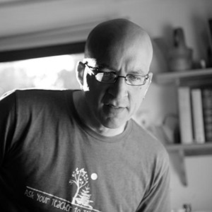

	

		

      
    

    

      
    

    

      
    

    

      
    

    

      
    

    

      
    

    

      
    

    

      
    

    

      
    

    

      
    

    

      
    

    

      
    

    

      
    

    

      
    

    

      
    

    

      
    

    

      
    

    

      
    

    

      
    

    

      
    

	

  
  Thecla Schiphorst is Director and Professor in the School of Interactive Arts and Technology at Simon Fraser University in Vancouver, Canada. Her background in dance and computing form the basis for her research in embodied interaction, focusing on movement knowledge representation, tangible and wearable technologies, media and digital art, and the aesthetics of interaction.  
  <a href="https://www.sfu.ca/~tschipho/" target="_blank">https://www.sfu.ca/~tschipho/</a> 
  <a href="http://www.movingstories.ca/" target="_blank">http://www.movingstories.ca/</a>

  
  Jules Françoise is a postdoctoral fellow in Human-Computer Interaction at Simon Fraser University (SFU) in Vancouver. His research interests intersect HCI and machine learning for expressive movement analysis and modelling. In particular, he is interested in understanding how continuous multimodal feedback (in particular involving auditory feedback) can support movement learning and expression.
    
  <a href="https://www.julesfrancoise.com/" target="_blank">https://www.julesfrancoise.com/</a> 
  <a href="http://movementcomputing.org/" target="_blank">http://movementcomputing.org/</a>

  
  Philippe Pasquier is Associate Professor at Simon Fraser University's School of Interactive Arts and Technology. He is both a scientist specialized in artificial intelligence and a multi-disciplinary artist. His contributions range from theoretical research in artificial intelligence, multi-agent systems and machine learning to applied artistic research and practice in digital art, computer music, and generative art.
    
  <a href="http://philippepasquier.com/" target="_blank">http://philippepasquier.com/</a> 
  <a href="http://www.Metacreation.net" target="_blank">http://www.Metacreation.net</a> 
  <a href="http://MusicalMetacreation.org" target="_blank">http://MusicalMetacreation.org</a> 
  <a href="https://www.kadenze.com/programs/generative-art-and-computational-creativity" target="_blank">https://www.kadenze.com/programs/generative-art-and-computational-creativity</a>

  
  Frédéric Bevilacqua is the head of the Sound Music Movement Interaction team at IRCAM in Paris. His research concerns the modeling and the design of interaction between movement and sound, and the development of gesture-based interactive systems.
    
  <a href="http://frederic-bevilacqua.net/" target="_blank">http://frederic-bevilacqua.net/</a> 
  <a href="http://ismm.ircam.fr" target="_blank">http://ismm.ircam.fr</a>  
  <b>Projects (Past/Current):</b> 
  <a href="http://rapidmix.goldsmithsdigital.com/" target="_blank">http://rapidmix.goldsmithsdigital.com/</a> 
  <a href="http://cosima.ircam.fr/home/" target="_blank">http://cosima.ircam.fr/home/</a> 
  <a href="http://legos.ircam.fr/" target="_blank">http://legos.ircam.fr/</a> 
  <a href="http://skatvg.iuav.it/" target="_blank">http://skatvg.iuav.it/</a> 
  <a href="http://www.smart-labex.fr/ISMES.html and" target="_blank">http://www.smart-labex.fr/ISMES.html and</a> 
  <a href="http://www.smart-labex.fr/SeNSE.html" target="_blank">http://www.smart-labex.fr/SeNSE.html</a> 
  <b>Future Project:</b> 
  Collaboration with  <a href="http://motionbank.org/" target="_blank">http://motionbank.org/</a> 

  
  Karen Kohn Bradley CMA is a LIMS® Certified Movement Analyst, and is currently the Director of Graduate Studies in Theatre, Dance, and Performance Studies at the University of Maryland, College Park. She studies the nonverbal and movement behaviors of political leaders, coaches actors and dancers, writes, directs, and choreographs politically oriented performance pieces, choreographs for theatre, and researches and writes about dance education issues.
    
  <a href="http://tdps.umd.edu/faculty/karen-bradley" target="_blank">http://tdps.umd.edu/faculty/karen-bradley</a> 
  <a href="http://www.limsonline.org/" target="_blank">http://www.limsonline.org/</a> 

  
  Baptiste Caramiaux is a Marie Skłodowska-Curie Research Fellow in Human-Computer Interaction (HCI) at McGill University (Montreal) and IRCAM (Paris). His research focuses on interactive technology for motor skill acquisition involving methods from psychology and machine learning. He holds a PhD from University Pierre & Marie Curie in Paris and IRCAM.
    
  <a href="http://www.baptistecaramiaux.com " target="_blank">http://www.baptistecaramiaux.com </a>  
  <b>Relevant projects:</b> 
  Role of Tempo Variability on Skill Learning:
  <a href="http://baptistecaramiaux.com/projects.html#tempovariability" target="_blank">http://baptistecaramiaux.com/projects.html#tempovariability</a> 
  Gesture Variation Following (GVF): Algorithm and Applications:
  <a href="http://baptistecaramiaux.com/projects.html#variationfollower" target="_blank">http://baptistecaramiaux.com/projects.html#variationfollower</a> 
  Understanding Gesture Expressivity through Muscle Sensing:
  <a href="http://baptistecaramiaux.com/projects.html#gestureexpressivity" target="_blank">http://baptistecaramiaux.com/projects.html#gestureexpressivity</a> 
  Form Follows Sound: Workshops on Sonic Interaction Design:
  <a href="http://baptistecaramiaux.com/projects.html#ffs" target="_blank">http://baptistecaramiaux.com/projects.html#ffs</a> 

  
  TODO KristinCarlson
    
  <a href="http://link.com" target="_blank">http://link.com</a> 

  
  TODO SheelaghCarpendale
    
  <a href="http://link.com" target="_blank">http://link.com</a> 

  
  Sarah Fdili Alaoui is an associate professor at LRI-Université Paris-Sud in Human Computer Interaction and interactive arts. She is also choreographer, a dancer and a Laban Movement Analyst. She was a researcher at SIAT SFU within the MovingStories project. She holds a PhD in Art and Science from University Paris-Sud and IRCAM, an MSc from University Joseph Fourier and ENSIMAG in Applied Mathematics and over 20 years of training in dance. Sarah collaborates with dancers and choreographers to create interactive installations, performances and tools for supporting choreography.
    
  <a href="http://saralaoui.com/" target="_blank">http://saralaoui.com/</a> 

  
  Dana Kulić is an Associate Professor with the Department of Electrical and Computer Engineering, University of Waterloo, Waterloo, ON, Canada. Her research interests include human motion analysis, robot learning, humanoid robots, and human–machine interaction.
    
  <a href="https://ece.uwaterloo.ca/~dkulic/" target="_blank">https://ece.uwaterloo.ca/~dkulic/</a> 
  <a href="http://livingarchitecturesystems.com/" target="_blank">http://livingarchitecturesystems.com/</a> 

  
  TODO LianLoke
    
  <a href="http://link.com" target="_blank">http://link.com</a> 

  
  TODO SylvainMoreno
    
  <a href="http://link.com" target="_blank">http://link.com</a> 

  
  Marcelo M. Wanderley is Full Professor of Music Technology at McGill University, Canada, and International Chair at Inria Lille, France. His research interests include the design and evaluation of digital musical instruments and the analysis of performer movements. He is a senior member of the ACM and of the IEEE.
    
  <a href="http://www.idmil.org" target="_blank">http://www.idmil.org</a> 
  <a href="http://cirmmt01.businesscatalyst.com/mmr.html" target="_blank">http://cirmmt01.businesscatalyst.com/mmr.html</a> (CFI-funded new infrastructure "Live Expression 'in situ': Musical and Audiovisual Performance and Reception") 

  
  TODO NorahZunigaShaw
    
  <a href="http://link.com" target="_blank">http://link.com</a> 

  
  TODO LynBartram
    
  <a href="http://link.com" target="_blank">http://link.com</a> 

  
  TODO SteveDiPaola
    
  <a href="http://link.com" target="_blank">http://link.com</a> 

  
  TODO DianeGromala
    
  <a href="http://link.com" target="_blank">http://link.com</a> 

  
  TODO AthomasGoldberg
    
  <a href="http://link.com" target="_blank">http://link.com</a> 

  
  Maria Lantin is the Director of the Stereoscopic 3D Centre at Emily Carr University of Art + Design. She has a deep interest in space and movement both physical and metaphorical, and this is woven through her work in immersive media and interaction.
    
  <a href="http://www.marialantin.com" target="_blank">http://www.marialantin.com</a> 

  
  Associate Professor Bernhard Riecke combines multidisciplinary research approaches and immersive virtual environments to investigate what constitutes effective, robust, embodied and intuitive human spatial cognition, orientation and behaviour as well as presence/immersion. He applies this to design more embodied and effective human-computer interactions, for example to give users a glimpse of the “overview effect”, an awareness shift experienced by astronauts when they see the Earth from space and realize how fragile it is.
    
  <a href="http://ispace.iat.sfu.ca/riecke/" target="_blank">http://ispace.iat.sfu.ca/riecke/</a> 
  <a href="http://ispace.iat.sfu.ca/project/earthgazing/" target="_blank">http://ispace.iat.sfu.ca/project/earthgazing/</a> 
  <a href="http://ispace.iat.sfu.ca/project/pulse-breath-water/" target="_blank">http://ispace.iat.sfu.ca/project/pulse-breath-water/</a> 
  <a href="http://ispace.iat.sfu.ca/project/transition2vr/" target="_blank">http://ispace.iat.sfu.ca/project/transition2vr/</a> 
  <a href="http://ispace.iat.sfu.ca/project/cross-disciplinary-immersion-framework/" target="_blank">http://ispace.iat.sfu.ca/project/cross-disciplinary-immersion-framework/</a> 

